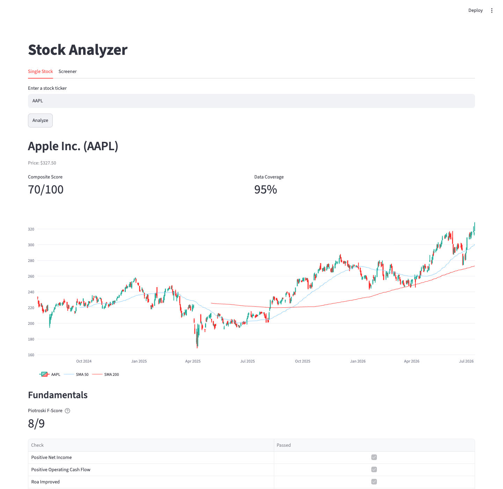
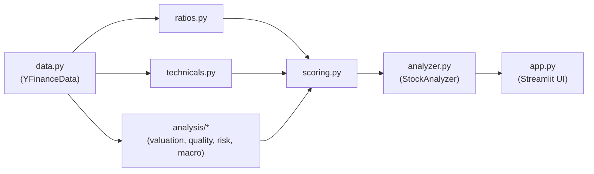

# Stock Analyzer

[](https://github.com/berkaykoklu/stock-analyzer/actions/workflows/ci.yml)

A multi-factor stock analysis tool combining fundamentals (Piotroski F-score), technicals (RSI, MACD, SMA trend), valuation, quality/moat, risk, and sentiment into a single composite score, with macro context displayed as separate analytical context. When a data source is missing — a ticker with no cash flow statement, insufficient price history for a 200-day SMA — the composite score renormalizes its weights over whatever *is* available and reports the resulting coverage, rather than quietly filling the gap with a neutral 50.



## Quickstart

```bash
uv sync
uv run streamlit run app.py
```

## Architecture



`data.py` fetches everything behind a `MarketData` Protocol. `ratios`, `technicals`, and `analysis/*` are pure functions over that data. `scoring.py` combines their outputs into a composite score. `analyzer.py` wires all of it into a single frozen `AnalysisReport`. `app.py` renders that report — it computes nothing itself, except the candlestick chart, which pulls raw OHLCV data and computes SMA overlays via `compute_indicators`.

## Design notes

**Weight renormalization over substituting 50.** A composite score is a weighted average of fundamental, valuation, technical, quality, risk, and sentiment components. If one component can't be computed, substituting a neutral value pulls the score toward the middle without saying so — a stock scored on 3 of 6 factors looks identical to one scored on all 6. Instead, `scoring.composite_score` renormalizes the weights over the components that are actually `available` and reports `coverage` (the fraction of total weight backed by real data), so a low-coverage score is visibly a low-coverage score.

**Tests never touch the network.** `MarketData` is a `Protocol`; tests construct a `FakeMarketData` from fixture DataFrames instead of hitting yfinance. This keeps the suite fast and deterministic and means CI doesn't depend on a third-party API being up or rate-limit-friendly.

**Presentation quarantined in `app.py`.** Every module below `app.py` returns plain data — frozen dataclasses, dicts, floats — with no `print`, no Streamlit calls, no formatting decisions baked in. `app.py` is the only place that renders. That boundary is what makes the core testable without a browser and reusable outside Streamlit (a CLI or a notebook could consume the same `AnalysisReport`).

## Roadmap

Deferred from the legacy version this was ported from, not yet implemented:

- ML-based price-movement predictor
- FinBERT-based news sentiment (the `sentiment` weight in the composite score is currently always unavailable)

## Disclaimer

Educational/portfolio project. Not investment advice.

## License

MIT — see [LICENSE](LICENSE).
